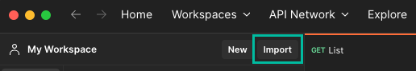
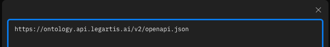
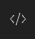
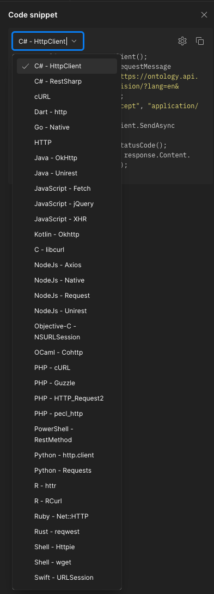

# Third party integrations

## Open openapi specifications in Postman

Open Postman App and find the import button

Paste one of the openapi.json urls from the table above to import all legartis api's of a certain service.

To export api request code in any programming language, hit the 'code' button.

Then select your preferred programming language to export the http request code:

## Create client sdk with Swagger Codegen

Installation: https://swagger.io/docs/open-source-tools/swagger-codegen/
swagger-codegen generate -i https://document.api.legartis.ai/v2/openapi.json -lpython

Consult [official documentation](https://swagger.io/docs/open-source-tools/swagger-codegen/) for further information.

## Create client sdk with openapi-python-client

pip install openapi-python-client
openapi-python-client update --url https://document.api.legartis.ai/v2/openapi.json

Consult [official documentation](https://github.com/openapi-generators/openapi-python-client) for further information.

